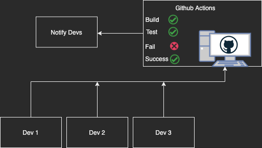

# Github CI Workflow

 

Basically this is a simple workflow that will run tests on the code when any commit pushes to the repository. I used [Node.js](https://nodejs.org/en/) with [express](https://www.npmjs.com/package/express) and for tests I used [chai](https://www.npmjs.com/package/chai), [chai-http](https://www.npmjs.com/package/chai-http) and [mocha](https://www.npmjs.com/package/mocha).

## What is CI

CI stands for Continuous Integration. It is a process where multiple developers work together contribute to changes code, add feature for a project. It's a DevOps practice. Developers frequently merge code changes in a central repository where the project is build, test and run on the CI server. 

 Figure: Github Actions CI
